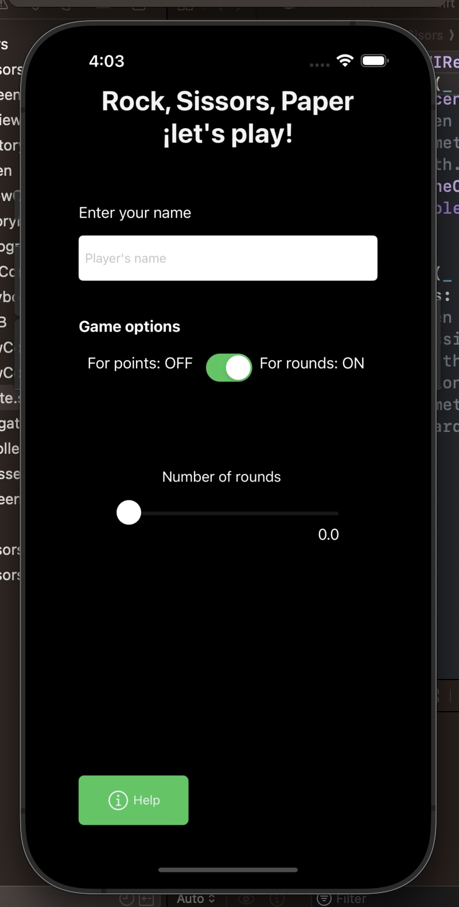
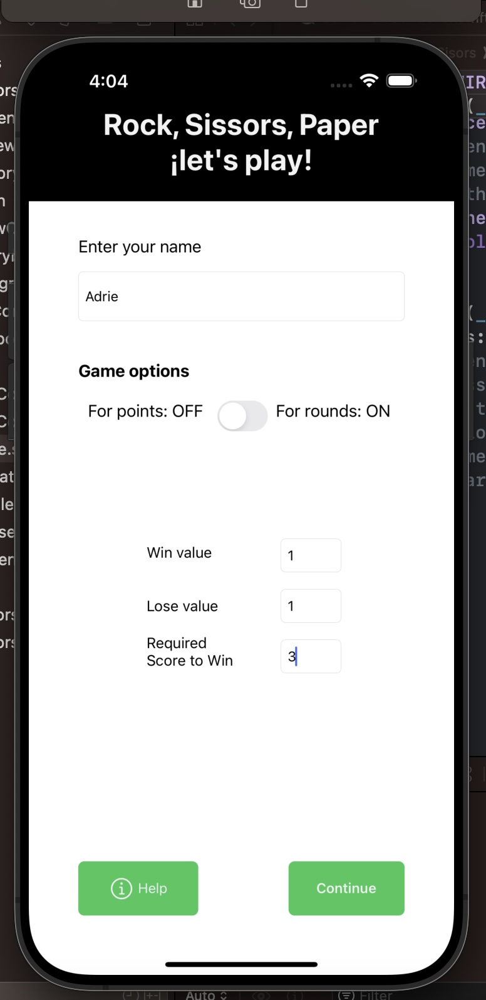
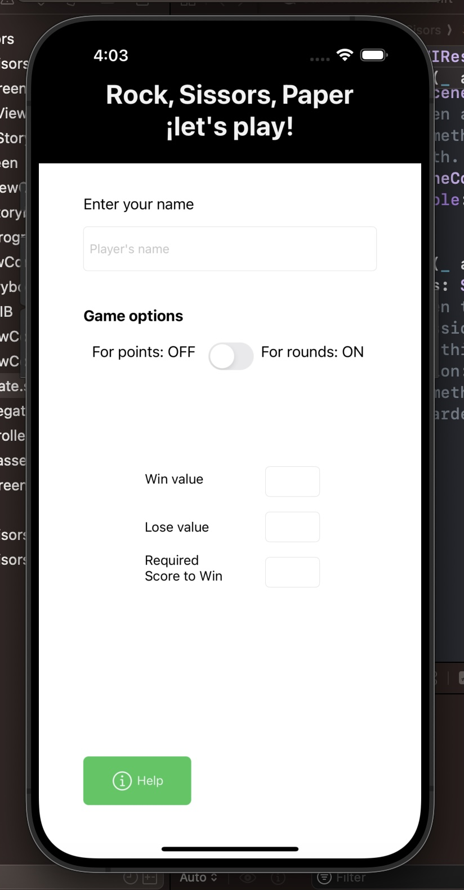
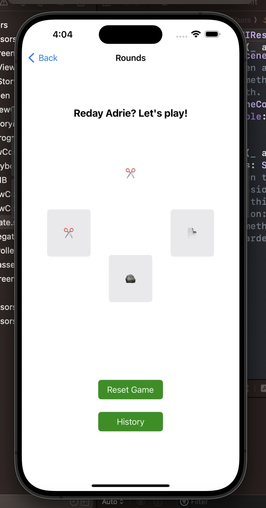

# Rock, Paper, Scissors✂️🪨📄

Este es un juego móvil que simula el clásico juego de "Piedra, Papel o Tijera" con dos versiones de juego, por puntos o por rondas.

## Capturas de Pantalla

## Implementación de Pantallas

- **Pantalla de Inicio**
  - Incluye un LaunchScreen con una imagen relacionada con el juego.

- **Pantalla de Configuración**
  - **Nombre del Jugador**: Proporciona un campo de texto obligatorio para que el jugador ingrese su nombre.
  - **Opciones del Juego**:
    - Los jugadores pueden elegir entre dos modos de juego: por rondas o por puntos.
    - Para rondas, un deslizador permite seleccionar el número de rondas necesarias para ganar (valores de 1 a 5).
    - Para puntos, incluye campos para el valor de victoria, valor de derrota y el puntaje requerido para ganar la sesión.
  - **Botón "Continuar"**: Aparece cuando todos los campos se llenan correctamente, permitiendo que los jugadores avancen.
  - **Botón "Información"**: Lleva al usuario a una pantalla que explica las reglas del juego de "Piedra, Papel o Tijera", incluyendo una sección de reconocimientos que contiene tu nombre.

- **Pantalla de Juego**
  - Muestra tres botones representando las opciones de "Piedra", "Papel" o "Tijera".
  - El fondo cambia para indicar el resultado del juego (verde para victoria, rojo para derrota, marrón para empate).
  - Una etiqueta muestra el resultado junto con el nombre del jugador.
  - Modo de Juego:
    - Por Puntos: Muestra un contador de puntos en tiempo real. Muestra alertas al alcanzar el puntaje de victoria.
    - Por Rondas: Muestra un contador de rondas. Muestra alertas al alcanzar el número seleccionado de rondas.
  - **Botón "Siguiente Turno"**: Aparece después de cada ronda para que el usuario pueda proceder.
  - **Botón "Reiniciar Juego"**: Restaura todas las opciones y valores a sus estados iniciales.

- **Pantalla de Historial**
  - Un botón en la Pantalla de Juego permite a los usuarios ver el historial del juego.
  - La información del juego almacenada en un array se muestra en un TextView, accesible solo durante la sesión de la aplicación.

- **Storyboard**: Pantalla de Inicio.
- **XIBs**: Pantalla de Configuración.
- **Programático**: Historial
- **Enfoque Personalizado**: Pantalla de juego.

¡Siéntete libre de contribuir y mejorar el juego! Para obtener más detalles, consulta las implementaciones de pantalla respectivas en los archivos del proyecto.

